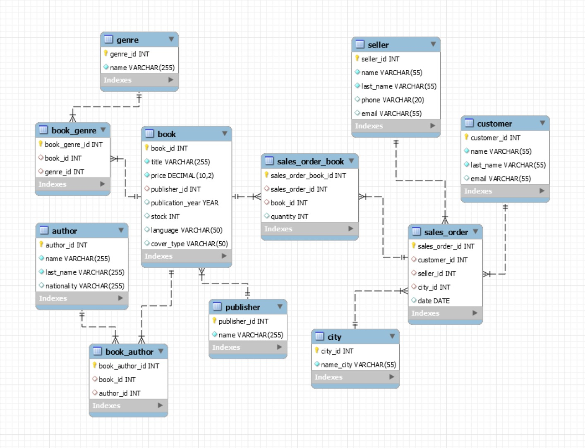
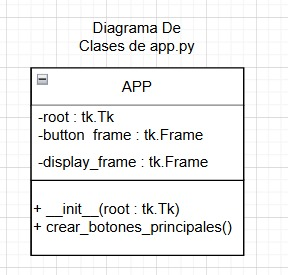
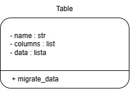
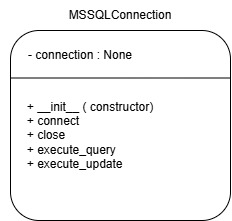

# Modernización del Sistema de Gestión de Datos

## Descripción del Proyecto

Este proyecto tiene como objetivo modernizar un sistema heredado que gestiona datos, mejorando su eficiencia, confiabilidad y usabilidad. Se ha diseñado e implementado un nuevo sistema utilizando una base de datos relacional y una aplicación en Python, garantizando una interfaz fácil de usar para la gestión de datos.

## Funcionalidades del Proyecto

### 1. Migración de Datos

El sistema incluye un script en Python que permite migrar datos de una base de datos MySQL a una nueva base de datos en SQL Server. Dentro de la carpeta `mysql_to_sqlserver` están cuatro archivos; en el archivo llamado `config.py` se modifican las credenciales de MySQL y SQL Server para realizar la migración. En `mssql_connection.py` se conecta a SQL Server y en `mysql_connection.py` se conecta a MySQL. Finalmente, en `value_migrate.py` ocurre la migración, estableciendo una conexión con la base de datos al iniciar y cerrándola al salir, manejando errores.

### 2. Interfaz de Usuario con Python Tkinter

Se ha desarrollado una interfaz gráfica utilizando la biblioteca Tkinter de Python, permitiendo a los usuarios gestionar la base de datos migrada con las siguientes funcionalidades:

- **Visualización de Registros**: Muestra los datos de las tablas en una lista o tabla dentro de la interfaz.
- **Adición de Registros**: Proporciona un formulario para ingresar nuevos datos en las tablas.
- **Modificación de Registros**: Permite la edición de registros existentes de forma intuitiva.
- **Eliminación de Registros**: Facilita la eliminación segura de registros seleccionados.

## Pruebas de la Solución

Se han implementado pruebas para asegurar que todas las funcionalidades de la interfaz funcionen correctamente:

1. **Pruebas de las Acciones Principales**:
   - Verificación de que los datos se muestren correctamente en la interfaz.
   - Confirmación de que las operaciones de adición, modificación y eliminación actualicen la base de datos.
   - Validación de que la búsqueda devuelva los resultados esperados.

2. **Validación de Entradas**:
   - Manejo adecuado de errores de entrada (campos vacíos, formatos incorrectos, etc.).
   - Mensajes claros en caso de errores.

3. **Pruebas de Integridad de Datos**:
   - Verificación de que los cambios realizados desde la interfaz se reflejen correctamente en la base de datos.
   - Confirmación de que los datos permanezcan consistentes tras varias operaciones.

4. **Pruebas de Cierre de Conexión**:
   - Verificación de que la conexión a la base de datos se cierre correctamente al cerrar la aplicación.

## Gráficos del Proyecto

A continuación se presentan los diagramas que ilustran la estructura y el funcionamiento del sistema:

### Modelo de Entidad-Relación

### Diagrama de Clases - Interfaz

### Diagrama de Clases - Migración de Datos

### Diagrama de Clases - Conexión MySQL

### Diagrama de Clases - Conexión SQL Server

### Pseudocodigo - Migracion
FUNCIÓN migrate_data
    mysql_conn = CONEXIÓN_MYSQL()
    mssql_conn = CONEXIÓN_MSSQL()

    TRATAR
        mysql_conn.conectar()
        mssql_conn.conectar()

        db_name = CONFIGURACIÓN_MYSQL['database']
        use_db_query = "USE " + db_name + ";"
        mssql_conn.ejecutar_actualización(use_db_query)

        // Verificar si la base de datos MS SQL Server está vacía
        check_empty_db_query = "SELECT COUNT(*) AS TotalTablas FROM INFORMATION_SCHEMA.TABLES;"
        resultado = mssql_conn.ejecutar_consulta(check_empty_db_query)
        tablas_db = resultado[0]

        // Asegúrate de que el resultado sea una lista de diccionarios
        SI tablas_db[0] == 0 ENTONCES
            // Obtener nombres de tablas de MySQL
            tablas = mysql_conn.ejecutar_consulta("SHOW TABLES;")
            IMPRIMIR "Tablas recuperadas de MySQL: " + tablas

            foreign_keys_list = []

            // Iniciar transacción
            mssql_conn.ejecutar_actualización("BEGIN TRANSACTION;")

            TRATAR
                PARA CADA tabla EN tablas HACER
                    table_name = tabla['Tables_in_' + db_name]
                    IMPRIMIR "Migrando tabla: " + table_name

                    // Verificar si la tabla existe en MS SQL Server
                    table_exists_query = "SELECT * FROM INFORMATION_SCHEMA.TABLES WHERE TABLE_NAME = '" + table_name + "';"
                    table_exists = mssql_conn.ejecutar_consulta(table_exists_query)

                    SI NO table_exists ENTONCES
                        // Obtener esquema de tabla de MySQL
                        schema_query = "SHOW COLUMNS FROM " + table_name + ";"
                        columnas = mysql_conn.ejecutar_consulta(schema_query)

                        // Obtener información de clave primaria
                        primary_key_query = "SHOW KEYS FROM " + table_name + " WHERE Key_name = 'PRIMARY';"
                        primary_keys = mysql_conn.ejecutar_consulta(primary_key_query)

                        // Obtener información de clave foránea
                        foreign_key_query = """
                            SELECT
                                kcu.constraint_name,
                                kcu.table_name,
                                kcu.column_name,
                                kcu.referenced_table_name,
                                kcu.referenced_column_name
                            FROM
                                information_schema.table_constraints AS tc
                                JOIN information_schema.key_column_usage AS kcu
                                ON tc.constraint_name = kcu.constraint_name
                                AND tc.table_schema = kcu.table_schema
                            WHERE
                                tc.constraint_type = 'FOREIGN KEY' AND
                                tc.table_name = '""" + table_name + """';
                        """
                        foreign_keys = mysql_conn.ejecutar_consulta(foreign_key_query)

                        // Verificar si la tabla tiene claves foráneas
                        SI foreign_keys ENTONCES
                            foreign_keys_list.extend(foreign_keys)

                        // Crear tabla en MS SQL Server con tipos de datos corregidos
                        create_table_query = "CREATE TABLE " + table_name + " ("
                        PARA CADA columna EN columnas HACER
                            col_name = columna['Field']
                            col_type = columna['Type']

                            // Mapear tipo de datos de MySQL a tipo de datos de SQL Server
                            col_type_parts = col_type.split('(')
                            base_type = col_type_parts[0]
                            mapped_type = data_type_mapping.get(base_type, 'VARCHAR')

                            SI LONGITUD(col_type_parts) > 1 ENTONCES
                                // Manejar tipos con especificación de longitud
                                longitud = col_type_parts[1].replace(')', '')
                                mapped_type += "(" + longitud + ")"

                            create_table_query += col_name + " " + mapped_type + ", "

                        // Agregar restricción de clave primaria
                        SI primary_keys ENTONCES
                            primary_key_columns = [key['Column_name'] PARA key EN primary_keys]
                            primary_key_constraint = "PRIMARY KEY (" + ', '.join(primary_key_columns) + ")"
                            create_table_query += primary_key_constraint

                        create_table_query = create_table_query.rstrip(', ') + ");"
                        mssql_conn.ejecutar_actualización(create_table_query)

            EXCEPTO EXCEPCIÓN COMO e
                // Revertir transacción en caso de error
                mssql_conn.ejecutar_actualización("ROLLBACK;")
                IMPRIMIR "Error durante la creación de la tabla o la adición de claves foráneas: " + e
                RETORNAR

            // Insertar datos en las tablas
            PARA CADA tabla EN tablas HACER
                table_name = tabla['Tables_in_' + db_name]
                IMPRIMIR "Insertando datos en la tabla: " + table_name

                // Obtener datos de MySQL
                data_query = "SELECT * FROM " + table_name + ";"
                datos = mysql_conn.ejecutar_consulta(data_query)

                // Insertar datos en MS SQL Server
                PARA CADA fila EN datos HACER
                    insert_query = "INSERT INTO " + table_name + " VALUES ("
                    PARA CADA valor EN fila.values() HACER
                        SI TIPO(valor) ES CADENA ENTONCES
                            insert_query += "'" + valor.replace("'", "''") + "', "  // Escapar comillas simples
                        SINO
                            insert_query += "'" + valor + "', "
                    insert_query = insert_query.rstrip(', ') + ");"
                    TRATAR
                        mssql_conn.ejecutar_actualización(insert_query)
                    EXCEPTO EXCEPCIÓN COMO e
                        IMPRIMIR "Error: " + e  // Mostrar el error pero continuar con el siguiente registro

            // Agregar restricciones de clave foránea a MS SQL Server
            PARA CADA fk EN foreign_keys_list HACER
                constraint_name = fk['CONSTRAINT_NAME']
                table_name = fk['TABLE_NAME']
                column_name = fk['COLUMN_NAME']
                referenced_table_name = fk['REFERENCED_TABLE_NAME']
                referenced_column_name = fk['REFERENCED_COLUMN_NAME']

                alter_table_query = """
                ALTER TABLE """ + table_name + """
                ADD CONSTRAINT """ + constraint_name + """
                FOREIGN KEY (""" + column_name + """)
                REFERENCES """ + referenced_table_name + """ (""" + referenced_column_name + """);
                """

                TRATAR
                    mssql_conn.ejecutar_actualización(alter_table_query)
                    IMPRIMIR "Restricción de clave foránea agregada exitosamente a la tabla '" + table_name + "'."
                EXCEPTO EXCEPCIÓN COMO e
                    IMPRIMIR "Error al agregar restricción de clave foránea a la tabla '" + table_name + "': " + e

            // Agregar columna "modificación" a cada tabla existente
            PARA CADA tabla EN tablas HACER
                table_name = tabla['Tables_in_' + db_name]
                IMPRIMIR "Agregando columna 'modificación' a la tabla: " + table_name

                // Verificar si la columna ya existe
                check_column_query = """
                    SELECT COLUMN_NAME FROM INFORMATION_SCHEMA.COLUMNS
                    WHERE TABLE_NAME = '""" + table_name + """' AND COLUMN_NAME = 'modificacion';
                """
                column_exists = mssql_conn.ejecutar_consulta(check_column_query)

                SI NO column_exists ENTONCES
                    alter_table_query = "ALTER TABLE " + table_name + " ADD modificacion DATETIME;"
                    TRATAR
                        mssql_conn.ejecutar_actualización(alter_table_query)
                        IMPRIMIR "Columna 'modificación' agregada a la tabla: " + table_name
                    EXCEPTO EXCEPCIÓN COMO e
                        IMPRIMIR "Error al agregar columna 'modificación' a la tabla " + table_name + ": " + e

    EXCEPTO EXCEPCIÓN COMO e
        IMPRIMIR "Error durante la migración: " + e
    FINALMENTE
        mysql_conn.cerrar()
        mssql_conn.cerrar()
FIN FUNCIÓN

## Colaboradoras

- **Nicole Lozada León**  
  Email: [nicole.lozada@ucb.edu.bo](mailto:nicole.lozada@ucb.edu.bo)

- **Dariana Pol Aramayo**  
  Email: [dariana.pol@ucb.edu.bo](mailto:dariana.pol@ucb.edu.bo)

## Universidad

**Universidad Católica Boliviana**  
Ciudad: Santa Cruz

## Conclusión

Este proyecto ha logrado modernizar y optimizar la gestión de datos en la empresa, asegurando que el nuevo sistema sea robusto, eficiente y fácil de usar. La interfaz gráfica y la migración de datos han sido implementadas con éxito, proporcionando una solución confiable para la gestión de información.

